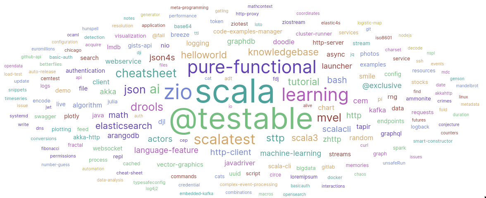
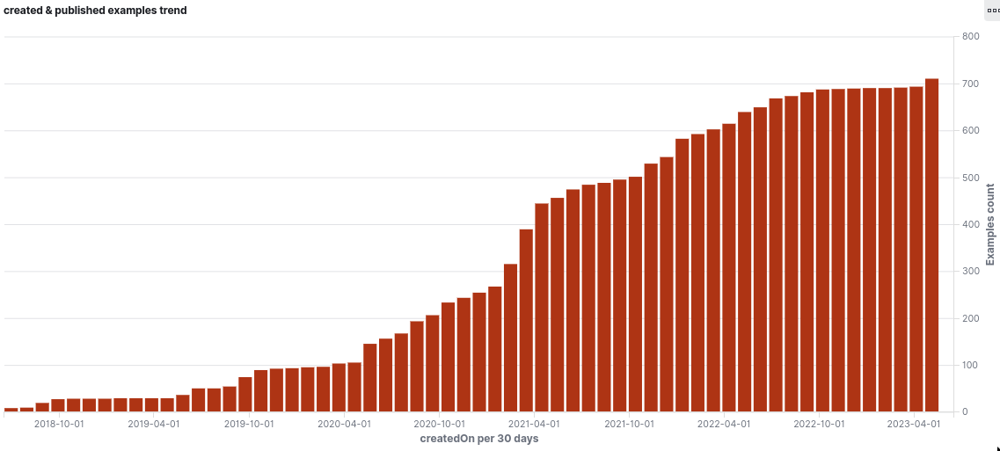

# CEM - Code Examples Manager [![][CodeExamplesManagerImg]][CodeExamplesManagerLnk] ![Scala CI][scalaci-master]

Code example manager (CEM) is a software tool which manage your notes and your code examples
and provide publish mechanisms to [github.com][githubcom] (as [gists][gists]) or
[gitlab.com][gitlabcom] (as [snippets][snippets]).

All my notes and code examples (my programming knowledge base) are now managed using this tool,
you can take a look to **[my public gists overview on github][mygists]** to illustrate the 
publishing work achieved by CEM. 



Current [Code example manager (CEM)][cem] implementation is just a command line tool
which compare locally available examples with already published ones in order to find
what it should do (add, update, do nothing).

## Why ?

Code examples are very important, each example is most of the time designed to focus
on a particular feature/characteristic of a programming language, a library or a framework.
They help us to quickly test, experiment and remember how bigger project or at least some
parts of them are working.

**[See the rules for good code examples][rules] for more information.**

Managing hundreds of published code example files as gists (github) and/or snippets (gitlab)
is really not easy and time-consuming, in particular if you want to keep them up to date. This
is the main issue addressed by this software. 



As you can see through the previous charts, once you have industrialized your notes and code
examples, analytics on your examples become quite easy, and a lot of advanced features become
possible... So stay connected to this project ;)

## Quick start

No particular prerequisites, just a Java >=8 JVM available, and
it will run on your Linux, Windows or MacOSX

Instructions example with github.com publishing configuration :
- Install the [coursier][csget] from @alxarchambault to automate
  the download/update/start of code-examples-manager directly from
  maven repositories
- Customize your configuration (see below for token configuration)
  ```
  export CEM_SEARCH_ROOTS="/home/myuser/myexamples"
  export CEM_SEARCH_GLOB="**/*.{sc,sh,*.md,*.jsh}"
  export CEM_GITHUB_TOKEN="xxxxx"
  ```
- Create an example file in `/home/myuser/myexamples` such as `hello.md`
  ```
  <!--
  // summary : my markdown cheat sheet
  // keywords : markdown, hello, example 
  // publish : gist
  // authors : someone, someonelse
  // id : d27245fc-22fb-4c9e-9809-feb0826400e7
  -->
  # Hello world !
  this is just an example
  ```
- Run the following command from your terminal (`cs` is the [coursier][cs] CLI command):
  ```
  cs launch fr.janalyse:code-examples-manager_3:2.1.0
  ```
  - you can even use `cs launch fr.janalyse:code-examples-manager_3:latest.release` to always use the latest release
  - current release is : [![][CodeExamplesManagerImg]][CodeExamplesManagerLnk]
- Check the command output to get the overview URL


## Code examples

In order to be published your code examples must come with a description header
inserted using single line comments. You must provide a unique identifier (UUID)
to each of your example, as well as a summary and publish keywords which define
remote destinations.

Example for languages using `//` for line comments :
```scala
// summary : Simplest scalatest test framework usage.
// keywords : scala, scalatest, pi, @testable
// publish : gist, snippet
// authors : David Crosson
// license : Apache
// id : d24d8cb3-45c0-4d88-b033-7fae2325607b
// execution : scala ammonite script (https://ammonite.io/) - run as follow 'amm scriptname.sc'
import $ivy.`org.scalatest::scalatest:3.2.0`
import org.scalatest._,matchers.should.Matchers._
math.Pi shouldBe 3.14d +- 0.01d

```

Request keys in description header are the following :
- **`summary`** : example one line summary.
- **`keywords`** : keywords describing your code features (comma separated).
- **`publish`** : publish destination keywords (comma separated)
  - the default configuration file provide those activation keywords :
    - `gist` : for github.com
    - `snippet` : for gitlab.com
- **`authors`** : code example authors list (comma separated).
- **`license`** : the example license.
- **`id`** : UUID for this code example. Generated using such commands :
  - [this ammonite scala script][uuid-sc].
  - This linux command (comes from package named uuid-runtime at least on debian based linux) :  
    `uuidgen`
  - This [ammonite][amm] oneliner :  
    `amm -c 'println(java.util.UUID.randomUUID.toString)'`
  - This python oneliner :  
    `python -c "import uuid, sys;sys.stdout.write(str(uuid.uuid4()))"`
  - Or use a dedicated UUID plugin for your IDE such as "UUID Generator" for IntelliJ IDEA
- **execution** : how to execute the example, execution runtime release constraints, ...

## CEM operations

Code examples manager operations :
- It reads its configuration
- It searches for code examples from the given directories roots
  - Only files with given extensions are selected (the given glob)
  - Selects code examples if and only if they contain a unique identifier (UUID)
- It publishes or updates remote code examples to remote destinations
  - the code example publish scope (`publish` keyword) select target destinations
    - comma separated publish activation keyword (`activation-keyword` parameter in configuration) 
  - It adds or updates a global overview of all published examples for a given destination
    - this summary has its own UUID defined in the configuration file 

## Configuration

The configuration relies on configuration files, a default one named `reference.conf` is provided.
This [default configuration file][referenceconf] defines default values and default behaviors and
allow a simple configuration way based on environment variables which override default values.

### Simplified configuration

| env or property name       | description                                                   | default value
|----------------------------|---------------------------------------------------------------|---------------------------
| CEM_SEARCH_ROOTS           | Examples search roots (comma separated)                       | ""
| CEM_SEARCH_GLOB            | Examples files globs                                          | "**/*.*"
| CEM_SEARCH_IGNORE_MASK     | Ignore file regular expression                                | "(/[.]bsp)|(/[.]scala)"
| CEM_EXAMPLES_OVERVIEW_UUID | The fixed UUID for the overview GIST which list all examples  | "cafacafe-cafecafe"
| CEM_CONFIG_FILE            | Your custom advanced configuration file (optional)            | *undefined*
| CEM_SUMMARY_TITLE          | Generated summary title                                       | Examples knowledge base
| CEM_GITHUB_ENABLED         | To enable or disable standard GITHUB support                  | true
| CEM_GITHUB_ACTIVATION_KEY  | Example publish keyword for github                            | "gist"
| CEM_GITHUB_TOKEN           | Github authentication token for gists API access              | *more information below*
| CEM_GITHUB_API             | Github API http end point                                     | "https://api.github.com"
| CEM_GITLAB_ENABLED         | To enable or disable standard GITLAB support                  | true
| CEM_GITLAB_ACTIVATION_KEY  | Example publish keyword for the gitlab                        | "snippet"
| CEM_GITLAB_TOKEN           | gitlab authentication token for snippets API access           | *more information below*
| CEM_GITLAB_API             | Gitlab API http end point                                     | "https://gitlab.com/api/v4"
| CEM_GITLAB_VISIBILITY      | Gitlab published examples chosen visibility                   | "public"

Configuration examples :
```shell
export CEM_SEARCH_ROOTS="/tmp/someplace,/tmp/someotherplace"
export CEM_SEARCH_GLOB="**/*.{sc,sh,*.md,*.jsh}"
export CEM_GITHUB_TOKEN="fada-fada-fada-fada"
```

### Advanced configuration

Take a look to the [configuration file][referenceconf] for more information about advanced configuration.

Once CEM installed you can modify the provided `conf/application.conf` file (whose content is by default
the same as the default [reference.conf][referenceconf] file), remember that any unset parameter in `application.conf`
will default to the value defined in `reference.conf`.

Note : It is also possible to provide a custom configuration file through the `config.file` java property or the
`CEM_CONFIG_FILE` environment variable.

## Authentication tokens

### Gitlab authentication token configuration

Get an access token from gitlab :
- Go to your user **settings**
  - Select **Access tokens**
    - Add a **Personal access token**
      - Enable scopes : `api` and `read_user`
- setup your `CEM_GITLAB_TOKEN` environment variable or `token` parameter in your configuration file
  with the generated token
- **Keep it carefully as it is not possible to retrieve it later.**
- **And of course KEEP IT SECURE**

### Github authentication token configuration

Get an access token from gitlab.com :
- Got to your user **settings**
  - Select **Developer settings**
    - Select **Personal access tokens**
      - Then **generate new token**
        - Enable scopes : `gist` and `read:user`
- setup your `CEM_GITHUB_TOKEN` environment variable or `token` parameter in your configuration file
  with the generated token, the value shown within curl json response
- **Keep it carefully as it is not possible to retrieve it later.**
- **And of course KEEP IT SECURE**

## Project history

- 2019-06 - PoC#1 example proof of concept
- 2019-07 - PoC#2 example proof of concept (in prod)
- 2019-08 - Switch to a real world project
- 2019-09 - In prod for my own usage
- 2020-07 - First public release
- 2021-05 - Full refactoring to use [ZIO][zio] - pure functional
- 2021-06 - Migration to Scala3
- 2021-12 - PoC#3 Search & Execution engines

## Acknowledgements

- A lot of thanks to [Li Haoyi][lihaoyi] for his wonderful work on [ammonite][amm] which is
  probably the best solution for code examples and scripting in [scala][scala].
- Of course a lot of thanks to the ZIO team, and the wonderful content they've made available
  on [ZIO site](zio), and on YouTube.
  

[CodeExamplesManager]:    https://github.com/dacr/code-examples-manager
[CodeExamplesManagerImg]: https://img.shields.io/maven-central/v/fr.janalyse/code-examples-manager_3.svg
[CodeExamplesManagerLnk]: https://search.maven.org/#search%7Cga%7C1%7Cfr.janalyse.code-examples-manager
[scalaci-master]: https://github.com/dacr/code-examples-manager/workflows/Scala%20CI/badge.svg
[mygists]: https://gist.github.com/c071a7b7d3de633281cbe84a34be47f1
[cem]: https://github.com/dacr/code-examples-manager
[amm]: https://ammonite.io/
[githubcom]: https://github.com/
[gitlabcom]: https://gitlab.com/
[snippets]: https://docs.gitlab.com/ce/user/snippets.html
[gists]: https://docs.github.com/en/github/writing-on-github/creating-gists
[uuid-sc]: https://gist.github.com/dacr/87c9636a6d25787d7c274b036d2a8aad
[scala]: https://www.scala-lang.org/
[lihaoyi]: https://github.com/lihaoyi
[ac2019]: https://www.alpescraft.fr/edition_2019/
[ac2019talk]: https://www.youtube.com/watch?v=61AGIBdG7YE
[referenceconf]: https://github.com/dacr/code-examples-manager/blob/master/src/main/resources/reference.conf
[latest]: https://github.com/dacr/code-examples-manager/releases/latest
[rules]: https://github.com/dacr/the-rules-for-good-code-examples
[cs]: https://get-coursier.io/
[csget]: https://get-coursier.io/docs/cli-installation
[zio]: https://zio.dev/